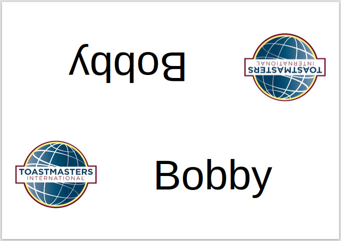

# Toastmaster Name Plaque Creator
This creates a webpage file with all your club members names, each will print on a sheet of A4.
Fold the paper/card lengthways, and the club member's name will appear on both sides.

**Examples here:**

Example with fold lines [Example Output](example_output.html).

Example without fold lines [Example Output](./example_output_without_fold_lines.html).



# Requirements
This requires python3 to be installed

# How to use
Edit the file toastmasters.txt with all your club members names on a single line.

Run this command to generate the html file:

```
python3 toastmastersNamePlaqueCreator.py
```

Open the file toastmasters_name_plaques.html and print, preferably on card.

## Printing
I printed on card where 15 sheets cost £1 in the Pound Shop in 2023. Their thickness was 200GSM.

Make sure to change the printer settings in the browser to print single sided. Double sided printing is someitmes called duplex printing, so make sure that's diabled.

For best results, use a card scoring board, which is how to put a professional crease in the card. You can see how these are used on youtube.

# Guest name paque
A page without a name will be created for guests to use.

If you laminate the card, guests can use a dry marker pen to write their names on.

After a session, you can wipe the plaque clean.

# Credits:
Thanks goes to the makers of paper.css, normalize.css :).

# License
```
Toastmasters image belongs to Toastmasters International.

Toasmasters Plaque Generator license
GNU GPL version 2 only.

PaperCSS license inside the file my_html.py
ISC Licence

NormalizeCSS license inside the file my_html.py
MIT License
```
